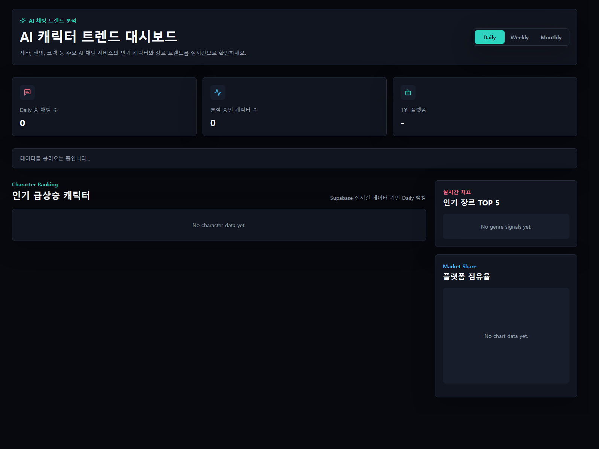
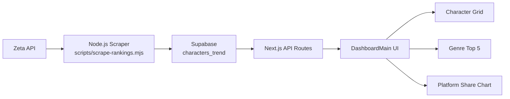

# AI Character Trend Dashboard


> Zeta API 기반 캐릭터 트렌드 데이터를 수집하고, Supabase에 적재한 뒤, Next.js 대시보드에서 실시간으로 시각화한 풀스택 프로젝트입니다.

## Highlights
- 외부 API 분석부터 데이터 적재, 시각화 대시보드 구현까지 하나의 흐름으로 완성한 풀스택 프로젝트
- Windows 실행 환경, API 차단, 환경변수 로딩, DB 스키마 충돌을 직접 디버깅하며 운영 안정성까지 개선
- 단순 CRUD를 넘어, 실제 서비스 환경의 불안정성을 해결한 문제 해결형 포트폴리오 프로젝트

## Preview


## 프로젝트 개요
AI 캐릭터 서비스의 실시간 인기 흐름을 데이터 기반으로 분석하고 시각화한 풀스택 프로젝트입니다. 제타(Zeta)의 실제 API 응답을 분석해 캐릭터별 채팅 수, 장르 태그, 서비스 정보를 수집하고, 이를 Supabase에 적재한 뒤 Next.js 대시보드에서 한눈에 볼 수 있도록 구성했습니다.

단순히 화면을 만드는 데서 끝나지 않고, 외부 API 차단 우회, Windows 실행 환경 이슈, 환경변수 로딩 문제, Supabase 스키마 충돌 등 실제 서비스형 프로젝트에서 자주 마주치는 문제를 직접 디버깅하고 해결한 경험을 담았습니다. 포트폴리오 관점에서는 "데이터 수집 - 저장 - 시각화 - 운영" 흐름을 처음부터 끝까지 다뤘다는 점이 강점입니다.

## Why This Project
- 외부 API 응답을 실서비스에 맞는 데이터 구조로 정제하는 경험을 담았습니다.
- 수집 스크립트, 데이터베이스, API, 프론트엔드를 하나의 흐름으로 연결했습니다.
- 단순 구현보다 디버깅과 운영 안정성 개선 과정이 강하게 드러나는 프로젝트입니다.
- Windows 로컬 환경과 외장하드 실행 환경까지 고려해 실제 사용성을 높였습니다.

## 기술 스택
- Frontend: Next.js 15, React 19, TypeScript, Tailwind CSS
- Backend/API: Next.js Route Handler
- Database: Supabase
- Scraper: Node.js
- Runtime/Automation: Windows Batch Script
- Visualization: Recharts

## 핵심 기능
- Zeta API 기반 캐릭터 데이터 수집
  - 실제 API 응답에서 캐릭터 ID, 이름, 이미지, 채팅 수, 해시태그를 추출해 정규화합니다.
- 실시간 DB 업데이트
  - 스크래퍼 실행 시 Supabase `characters_trend` 테이블에 upsert하여 최신 데이터를 반영합니다.
- 트렌드 대시보드 시각화
  - 인기 캐릭터 목록, 장르 TOP 5, 플랫폼 점유율을 대시보드 형태로 제공합니다.
- 운영 편의성 개선
  - Windows 환경에서 `.bat` 파일만으로 스크래퍼 실행과 대시보드 실행이 가능하도록 구성했습니다.
- 이동 가능한 실행 구조
  - 외장하드나 다른 드라이브에서도 동작하도록 배치 파일 경로를 상대경로 기준으로 정리했습니다.

## 아키텍처


## 데이터 흐름
1. `scripts/scrape-rankings.mjs`가 Zeta API를 호출합니다.
2. 응답 데이터를 프로젝트 스키마에 맞게 정제합니다.
3. 정제된 데이터를 Supabase `characters_trend` 테이블에 upsert합니다.
4. Next.js API Route가 Supabase 데이터를 조회합니다.
5. `DashboardMain`이 데이터를 받아 카드, 리스트, 차트 UI로 시각화합니다.

## 실행 방법
### 1) 패키지 설치
```bash
npm install
```

### 2) 대시보드 실행
```bash
npm run dev
```

또는 Windows 환경에서는 아래 파일로 실행할 수 있습니다.
- `run_dashboard.bat`

### 3) 스크래퍼 실행
```bash
node scripts/scrape-rankings.mjs
```

또는 Windows 환경에서는 아래 파일로 실행할 수 있습니다.
- `run_scraper.bat`

### 4) 환경변수
`.env.local` 예시

```env
NEXT_PUBLIC_SUPABASE_URL=your_supabase_url
NEXT_PUBLIC_SUPABASE_ANON_KEY=your_supabase_anon_key
SUPABASE_SERVICE_ROLE_KEY=your_supabase_service_role_key
```

## 프로젝트에서 집중한 포인트
- 외부 API 응답을 실제 서비스에서 사용할 수 있는 구조로 정제하는 데이터 모델링
- 클라이언트/서버/스크립트 환경마다 다른 환경변수 로딩 방식을 통합하는 운영 안정성 확보
- 단순 에러 회피가 아니라 원인을 추적하고 재현한 뒤 수정하는 디버깅 중심 개발
- 실행 환경이 바뀌어도 최대한 그대로 동작하도록 Windows 배치 실행 경험 개선

## 💡 트러블슈팅

### 1. Windows 터미널 한글 인코딩(BOM) 충돌로 인한 스크립트 실행 오류
**문제**
- `.bat` 파일 실행 시 한글 문구가 깨지면서 명령어까지 비정상적으로 해석되는 문제가 발생했습니다.
- 외장하드 환경이나 다른 PC에서 실행할 때 증상이 더 불안정하게 나타났습니다.

**원인**
- UTF-8 BOM과 Windows 기본 콘솔 인코딩 조합 때문에 배치 파일 첫 줄부터 문자가 깨졌고, 한글 출력이 들어간 상태에서 실행 안정성이 떨어졌습니다.

**해결**
- 초기에는 `chcp 65001`로 UTF-8 코드페이지를 맞췄고, 이후에는 더 안정적인 실행을 위해 배치 파일을 순수 ASCII 기반으로 재작성했습니다.
- 최종적으로는 한글 출력 자체를 제거하고, 파일 저장 인코딩을 ASCII로 통일해 BOM 이슈 가능성을 줄였습니다.
- 배치 파일의 작업 경로도 절대경로 대신 `cd /d "%~dp0"`로 변경해 외장하드 환경에서도 그대로 실행되도록 개선했습니다.

### 2. 외부 API 차단(400 Bad Request) 우회를 위한 헤더 변조 및 파라미터 최적화
**문제**
- Zeta의 `infinite-plots` API 호출 시 `400 Bad Request`가 발생하며 데이터 수집이 차단됐습니다.

**원인**
- 단순 fetch 요청만으로는 실제 브라우저 요청과 차이가 커서 차단 가능성이 높았고, 요청 파라미터도 서버가 기대하는 값과 달랐습니다.

**해결**
- 요청 URL의 `limit` 값을 실제 사용 패턴에 맞춰 `16`으로 조정했습니다.
- `User-Agent`, `Accept`, `Accept-Language`, `Referer`, `Origin` 헤더를 브라우저 수준으로 보강해 요청 신뢰도를 높였습니다.
- 실패 시에는 `response.text()`를 읽어 에러 본문까지 로그로 남기도록 개선해, 다음 디버깅 사이클에서 서버 응답을 더 정확히 해석할 수 있게 했습니다.

### 3. Node.js 스크래퍼 환경변수(.env.local) 인식 불가 문제 해결
**문제**
- `node scripts/scrape-rankings.mjs`로 스크래퍼를 단독 실행하면 Supabase URL 누락 에러가 발생했습니다.

**원인**
- Next.js 런타임에서는 `.env.local`을 자동 로드하지만, 단독 Node.js 프로세스는 이를 자동으로 읽지 않습니다.
- 또한 `.env.local`에는 `NEXT_PUBLIC_SUPABASE_URL` 형태로 값이 들어 있었는데, 스크래퍼는 처음에 `SUPABASE_URL`만 찾고 있었습니다.

**해결**
- `dotenv`를 도입해 스크래퍼 시작 시 `.env.local`을 직접 로드하도록 수정했습니다.
- 환경변수 해석 로직도 `NEXT_PUBLIC_SUPABASE_URL || SUPABASE_URL`, `SUPABASE_SERVICE_ROLE_KEY || NEXT_PUBLIC_SUPABASE_ANON_KEY || SUPABASE_ANON_KEY` 순으로 fallback 하도록 유연하게 보강했습니다.
- 이로써 Next.js와 스크래퍼가 서로 다른 실행 환경에서도 동일한 설정 파일을 재사용할 수 있게 됐습니다.

### 4. Supabase DB 스키마와 스크래퍼 데이터 간 매핑 불일치(PGRST204) 디버깅 및 해결
**문제**
- 스크래퍼 실행 시 Supabase upsert 단계에서 `PGRST204` 계열의 컬럼 매핑 오류가 발생했습니다.

**원인**
- DB 테이블 스키마는 `id`, `character_name` 컬럼을 기대했지만, 스크래퍼는 `character_id`, `name` 키로 데이터를 보내고 있었습니다.
- 즉, 외부 API 응답 구조를 내부 DB 스키마로 변환하는 정규화 단계가 완전히 맞지 않았습니다.

**해결**
- API 응답 매핑 로직을 DB 스키마 기준으로 다시 정리해 `id`, `character_name`, `image_url`, `service_name`, `genre_tags`, `chat_count`만 전송하도록 수정했습니다.
- 이 과정에서 "외부 데이터 모델"과 "내부 저장 스키마"를 구분해 관리해야 한다는 점을 명확히 정리했습니다.
- 결과적으로 upsert payload가 테이블 구조와 정확히 일치하게 되어 저장 단계 오류를 제거했습니다.

### 5. Next.js 빌드 캐시 꼬임 현상으로 인한 404 라우팅 에러 해결
**문제**
- 개발 중 특정 API 라우트나 페이지 접근 시 의도치 않은 404가 발생하거나, 수정한 코드가 반영되지 않는 현상이 발생할 수 있었습니다.

**원인**
- `.next` 빌드 산출물이 이전 상태를 유지하면서 라우팅 정보나 캐시가 꼬이는 경우가 있습니다.
- 특히 빠르게 API 구조를 수정하거나 파일 이동이 반복되면 개발 서버 캐시가 실제 파일 상태를 제대로 반영하지 못할 수 있습니다.

**해결**
- `.next` 디렉터리를 정리한 뒤 개발 서버를 재실행하는 방식으로 캐시를 초기화했습니다.
- 단순 재시작이 아니라 "빌드 캐시 문제인지 코드 문제인지"를 구분해 접근함으로써 디버깅 시간을 줄였습니다.
- 이 경험을 통해 프레임워크 문제처럼 보이는 현상도 캐시 계층까지 확인하는 습관을 갖게 됐습니다.

## 성과와 배운 점
- 실제 외부 API를 분석해 데이터 파이프라인을 끝까지 연결하는 경험을 만들었습니다.
- 프론트엔드 구현뿐 아니라, 데이터 적재 구조와 실행 환경까지 포함한 풀스택 관점의 문제 해결을 수행했습니다.
- 특히 이번 프로젝트에서는 "기능 구현"보다 "문제 재현 - 원인 추적 - 수정 - 재검증"의 루프를 반복하면서 디버깅 역량을 강화했습니다.
- 포트폴리오 관점에서 단순 CRUD가 아니라, 불안정한 외부 환경을 견디는 서비스형 프로젝트 경험을 보여줄 수 있다는 점이 가장 큰 자산입니다.

## 향후 개선 아이디어
- 스크래퍼 주기 실행 자동화 및 스케줄링
- 일간/주간/월간 데이터 분리 적재를 위한 테이블 스키마 고도화
- 서비스별 비교 지표와 성장률 추적 기능 확장
- 에러 로그를 별도 모듈로 분리해 운영 가시성 강화
- CI 환경에서 스키마 검증 및 스크래퍼 정상 동작 체크 자동화
